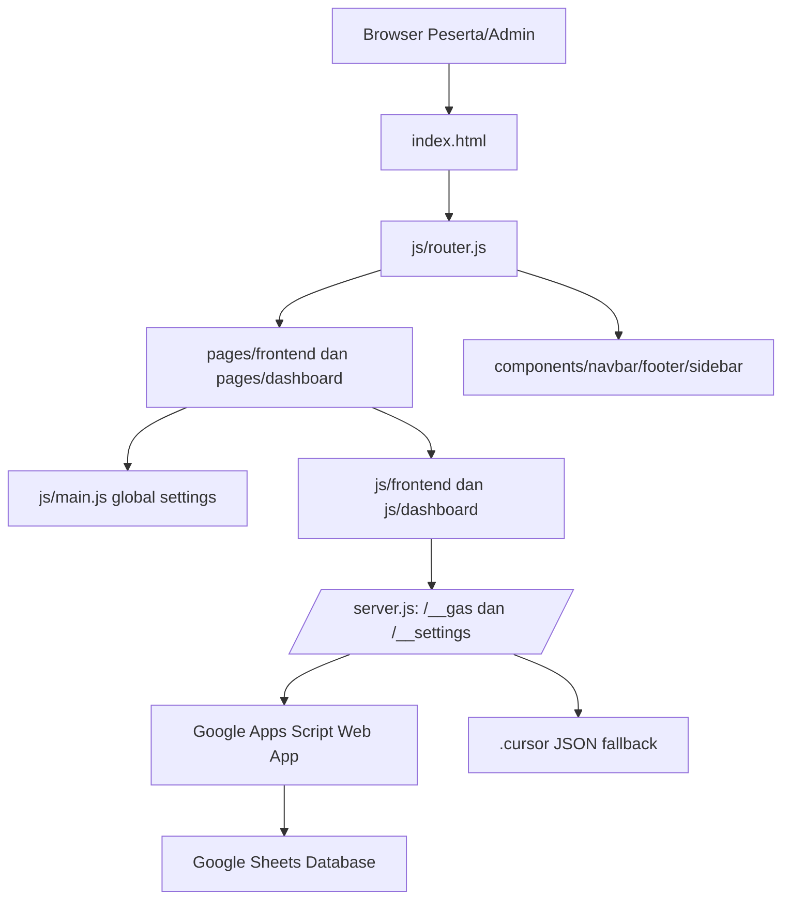

# HerAI Fellowship 2026 - Dokumentasi Pemeliharaan, Pengembangan, Database, API, dan SPA

**Versi dokumen:** 1.0  
**Tanggal:** 19 Mei 2026  
**Repository:** `woman-in-tech-FIXED`  
**Target pembaca:** engineer, maintainer, admin teknis, dan panitia operasional HerAI Fellowship.

## 1. Ringkasan Eksekutif

Dokumen ini adalah handover teknis untuk aplikasi HerAI Fellowship 2026. Aplikasi ini adalah Single Page Application (SPA) berbasis HTML, CSS, dan JavaScript vanilla, dengan backend utama Google Apps Script (GAS) dan fallback lokal melalui `server.js`. Sistem dirancang sebagai control panel acara: pendaftaran, seleksi tahap 1, AI pre-screening, skoring, pengumuman, profil peserta, seleksi tahap 2, pemantauan tes, project akhir, sertifikat, audit trail, aset, RBAC, dan global settings.

Secara operasional, aplikasi memiliki tiga lapisan penting:

- **Frontend SPA:** `index.html`, `js/router.js`, halaman di `pages/`, komponen di `components/`, dan stylesheet di `css/`.
- **Backend gateway lokal:** `server.js`, yang melayani static files, menyimpan settings lokal, meneruskan request ke GAS, dan menyediakan fallback data lokal.
- **Database GAS/Google Sheets:** `gas/Code.gs`, yang membuat sheet, schema, action API, dan fungsi CRUD berbasis spreadsheet.

Prinsip maintenance utama: perubahan UI harus mengikuti route map di `js/router.js`, perubahan database harus dimulai dari schema `gas/Code.gs`, dan perubahan API harus menjaga kontrak `action` berbasis POST JSON.

## 2. Quick Start untuk Maintainer

### 2.1 Menjalankan Lokal

```bash
cd /Users/marchelandrianshevchenko/Downloads/woman-in-tech-FIXED
node server.js
```

Aplikasi berjalan di:

```text
http://127.0.0.1:3000/
```

Gunakan hash route untuk membuka halaman:

```text
http://127.0.0.1:3000/#/home
http://127.0.0.1:3000/#/dashboard
http://127.0.0.1:3000/#/competency-test
http://127.0.0.1:3000/#/projects
```

### 2.2 Akun Uji Coba Lokal

Fallback lokal di `server.js` menyediakan peserta demo:

| Tipe | Nilai |
|---|---|
| NIK | `3276010101010001` |
| Password | `herai2026` |
| Nama | `Alya Putri Demo` |
| Status Tahap 1 | `lolos` |
| Stage | `accepted_stage_1` |

GAS seed default menyediakan admin:

| Field | Nilai |
|---|---|
| adminId | `super-admin` |
| password | `admin123` |
| role | `super_admin` |
| permissions | `all` |

### 2.3 File yang Paling Sering Diubah

| Area | File Utama | Catatan |
|---|---|---|
| Routing SPA | `js/router.js` | Tambahkan route baru dan panggil initializer halaman. |
| Global settings | `js/main.js`, `js/dashboard/admin-modules.js`, `server.js` | Settings disimpan di localStorage dan `/.cursor/global-settings.json`. |
| Database GAS | `gas/Code.gs` | Sumber schema Google Sheets dan API action. |
| Dashboard utama | `pages/dashboard/dashboard.html`, `js/dashboard/dashboard.js` | Seleksi tahap 1 dan panel pendaftar. |
| AI Pre-Screening | `pages/dashboard/ai-prescreening.html`, `js/dashboard/ai-prescreening.js` | Scan kandidat dan update skor AI. |
| Tes Kompetensi | `pages/frontend/competency-test.html`, `js/frontend/competency-test.js` | Peserta tes, section lock, timer, proctoring. |
| Monitor Tes | `pages/dashboard/competency-monitor.html`, `js/dashboard/competency-monitor.js` | Panitia memantau sesi tes. |
| Projects | `pages/frontend/projects.html`, `js/frontend/projects.js` | Submit final project dan gallery. |
| Pengumuman | `pages/frontend/announcement.html`, `js/frontend/announcement.js` | Tahap 1, Tahap 2, Final. |
| Profil Peserta | `pages/frontend/profile.html`, `js/frontend/profile.js` | Login NIK/password, edit profil, task/CV basis data. |

## 3. Arsitektur Sistem

### 3.1 Diagram Konseptual



### 3.2 Pola Data

Mayoritas request backend menggunakan pola:

```json
{
  "action": "namaAction",
  "field_lain": "nilai"
}
```

Respons standar:

```json
{
  "status": "success",
  "data": []
}
```

Respons error:

```json
{
  "status": "error",
  "message": "Penjelasan error"
}
```

Beberapa modul lama masih memanggil URL GAS langsung. Modul yang sudah memakai proxy lokal menggunakan `/_ _gas` tanpa spasi, yaitu path aktual `/__gas`. Untuk production yang lebih rapi, semua modul sebaiknya disatukan ke `/__gas` supaya masalah CORS, redirect GAS, dan fallback lokal terkendali di satu tempat.

## 4. Struktur Repository

```text
woman-in-tech-FIXED/
├── index.html
├── server.js
├── README.md
├── .htaccess
├── assets/
├── components/
│   ├── navbar.html
│   ├── footer.html
│   └── sidebar.html
├── css/
│   ├── style.css
│   ├── components/
│   └── frontend/
├── js/
│   ├── router.js
│   ├── main.js
│   ├── frontend/
│   └── dashboard/
├── pages/
│   ├── frontend/
│   └── dashboard/
├── gas/
│   └── Code.gs
└── .cursor/
    ├── global-settings.json
    ├── competency-sessions.json
    ├── project-submissions.json
    └── debug-86a842.log
```

### 4.1 Konvensi Folder

| Folder | Fungsi | Aturan Maintenance |
|---|---|---|
| `pages/frontend` | Halaman publik/peserta | Satu file HTML per halaman. Jangan inline logic berat. |
| `pages/dashboard` | Halaman admin/panitia | Harus disembunyikan navbar/footer publik oleh router. |
| `js/frontend` | Logic halaman publik/peserta | Initializer global: `window.initNamaHalaman`. |
| `js/dashboard` | Logic admin | Initializer global: `window.initNamaModul`. |
| `components` | Navbar, footer, sidebar | Dimuat sekali oleh router saat `DOMContentLoaded`. |
| `css/frontend` | Styling halaman dan dashboard | Ikuti style existing; hindari style global tanpa scope. |
| `gas` | Backend Google Apps Script | Update schema dan action bersama-sama. |
| `.cursor` | State lokal dev | Jangan dianggap database production. |

## 5. Dokumentasi SPA

### 5.1 Entry Point

`index.html` adalah shell SPA. File ini memuat:

- CSS global dan semua CSS halaman.
- Container `#navbar-container`.
- Container utama `#app-content`.
- Container `#footer-container`.
- Script frontend, dashboard, router, dan modul tambahan.

Route tidak berpindah file HTML secara browser-native. Router mengambil fragment hash seperti `#/projects`, lalu fetch HTML partial ke `#app-content`.

### 5.2 Lifecycle SPA

Urutan normal saat aplikasi dibuka:

1. Browser membuka `index.html`.
2. `DOMContentLoaded` berjalan di `js/router.js`.
3. `router.loadComponents()` fetch `navbar.html`, `footer.html`, dan `sidebar.html`.
4. `window.initNavbar()` dipanggil dari `js/main.js`.
5. `router.handleRouting()` membaca `window.location.hash`.
6. Router menentukan path dan file HTML partial.
7. Router fetch partial page dan mengisi `#app-content`.
8. Router menentukan layout admin atau publik.
9. Router memanggil initializer halaman sesuai path.
10. Jika hash berubah, proses routing diulang.

### 5.3 Route Catalog

| Route | HTML | Initializer | Tipe |
|---|---|---|---|
| `/`, `/home` | `pages/frontend/home.html` | `initPageInteractions` | Publik |
| `/projects` | `pages/frontend/projects.html` | `initProjectsPage` | Publik/Peserta |
| `/announcement` | `pages/frontend/announcement.html` | `initAnnouncement` | Publik |
| `/announcement-stage-1` | `pages/frontend/announcement.html` | `initAnnouncement` | Publik |
| `/announcement-stage-2` | `pages/frontend/announcement.html` | `initAnnouncement` | Publik |
| `/announcement-final` | `pages/frontend/announcement.html` | `initAnnouncement` | Publik |
| `/wall-of-fame` | `pages/frontend/wall-of-fame.html` | `initPageInteractions` | Publik |
| `/leaderboard` | `pages/frontend/leaderboard.html` | `initPageInteractions` | Publik |
| `/graduation` | `pages/frontend/graduation.html` | `initPageInteractions` | Publik |
| `/register` | `pages/frontend/register.html` | `initRegisterLogic` | Publik |
| `/profile` | `pages/frontend/profile.html` | `initParticipantProfile` | Peserta |
| `/competency-test` | `pages/frontend/competency-test.html` | `initCompetencyTest` | Peserta |
| `/twibbon` | `pages/frontend/twibbon.html` | `initTwibbon` | Publik |
| `/about-us` | `pages/frontend/about-us.html` | `initPageInteractions` | Publik |
| `/curriculum` | `pages/frontend/curriculum.html` | `initPageInteractions` | Publik |
| `/faq` | `pages/frontend/faq.html` | `initPageInteractions` | Publik |
| `/industry-applications` | `pages/frontend/industry-applications.html` | `initPageInteractions` | Publik |
| `/dashboard`, `/dashboard/seleksi` | `pages/dashboard/dashboard.html` | `initDashboardLogic` | Admin |
| `/skoring` | `pages/dashboard/skoring.html` | `initSkoringLogic` | Admin |
| `/ai-prescreening` | `pages/dashboard/ai-prescreening.html` | `initAiPreScreening` | Admin |
| `/anti-fraud` | `pages/dashboard/anti-fraud.html` | `initAntiFraud` | Admin |
| `/comm-engine` | `pages/dashboard/comm-engine.html` | `initCommEngine` | Admin |
| `/competency-monitor` | `pages/dashboard/competency-monitor.html` | `initCompetencyMonitor` | Admin |
| `/stage-control` | `pages/dashboard/stage-control.html` | `initStageControl` | Admin |
| `/bootcamp` | `pages/dashboard/bootcamp.html` | `initBootcamp` | Admin |
| `/final-project` | `pages/dashboard/final-project.html` | `initFinalProject` | Admin |
| `/certificates` | `pages/dashboard/certificates.html` | `initCertificates` | Admin |
| `/audit-trail` | `pages/dashboard/audit-trail.html` | `initAuditTrail` | Admin |
| `/global-settings` | `pages/dashboard/global-settings.html` | `initGlobalSettings` | Admin |
| `/rbac` | `pages/dashboard/rbac.html` | `initRbac` | Admin |
| `/assets` | `pages/dashboard/assets.html` | `initAssets` | Admin |

### 5.4 Menambah Halaman Baru

Checklist standar:

1. Buat HTML partial di `pages/frontend` atau `pages/dashboard`.
2. Buat JS logic di `js/frontend` atau `js/dashboard`.
3. Tambahkan `<script src="...">` di `index.html` bila file JS baru.
4. Tambahkan route di `router.routes`.
5. Jika halaman admin, masukkan path ke array `adminPages`.
6. Tambahkan pemanggilan initializer di `handleRouting()`.
7. Tambahkan link sidebar/navbar/footer jika perlu.
8. Test direct route dan hash navigation.

Contoh route baru:

```js
routes: {
  "/mentoring": "/pages/frontend/mentoring.html"
}
```

Contoh initializer:

```js
window.initMentoringPage = function() {
  // bind event dan render data
};
```

### 5.5 Layout Admin dan Sidebar

Admin pages disimpan dalam array `adminPages` di `js/router.js`. Jika path termasuk admin:

- Navbar publik disembunyikan.
- Footer publik disembunyikan.
- Sidebar admin dihydrate dari cache `window.__HERAI_SIDEBAR_HTML__`.
- Active state sidebar diupdate via `window.updateSidebarActiveState()` jika ada.

Tujuan caching sidebar: perpindahan halaman admin tidak lagi fetch ulang sidebar dan tidak tampak loading berulang.

### 5.6 Global Settings

Global settings didefinisikan di `js/main.js`.

| Key | Default | Dampak |
|---|---:|---|
| `registrationOpen` | `true` | Mengizinkan/menutup form pendaftaran publik. |
| `afirmasiOpen` | `true` | Mengaktifkan opsi jalur afirmasi. |
| `announcementLive` | `false` | Membuka portal pengumuman. |
| `announcementLaunchAt` | `''` | Jadwal otomatis pembukaan pengumuman. |
| `participantPortalOpen` | `false` | Menampilkan/mengizinkan halaman profil peserta. |
| `maintenanceMode` | `false` | Mengunci halaman publik dengan notice maintenance. |
| `registrationClosedMessage` | pesan default | Pesan saat pendaftaran ditutup. |
| `twibbonUrl` | `#/twibbon` | Link twibbon dari hasil pengumuman. |
| `passedInfoMessage` | pesan default | Pesan tambahan peserta lolos. |

Storage settings:

- Browser: `localStorage.heraiGlobalSettings`.
- Lokal server: `.cursor/global-settings.json` melalui endpoint `/__settings`.
- GAS production: `Settings` sheet melalui action `getSettings` dan `saveSettings`, namun modul lokal saat ini membaca `/__settings` untuk runtime lokal.

## 6. Backend Lokal `server.js`

### 6.1 Peran Server Lokal

`server.js` bukan hanya static server. Ia juga:

- Melayani SPA fallback ke `index.html`.
- Menyediakan proxy `/__gas` ke Google Apps Script.
- Menyediakan fallback lokal jika GAS tidak merespons JSON.
- Menyimpan global settings lokal.
- Menyimpan sesi competency test lokal.
- Menyimpan submission project lokal.
- Menyediakan debug log.

### 6.2 Environment

| Variabel | Default | Fungsi |
|---|---|---|
| `PORT` | `3000` | Port server lokal. |
| `HOST` | `127.0.0.1` | Host binding lokal. |

### 6.3 Endpoint Lokal

| Method | Path | Fungsi |
|---|---|---|
| GET | `/` | Serve `index.html`. |
| GET | `/<static-file>` | Serve static asset. |
| GET | `/__settings` | Baca settings lokal dari `.cursor/global-settings.json`. |
| POST | `/__settings` | Simpan settings lokal. |
| POST | `/__gas` | Proxy request action ke GAS, fallback lokal jika perlu. |
| POST | `/__debug` | Append JSON debug ke `.cursor/debug-86a842.log`. |

### 6.4 Kontrak `/__settings`

GET response:

```json
{
  "ok": true,
  "settings": {
    "registrationOpen": true,
    "announcementLive": false
  }
}
```

POST request:

```json
{
  "settings": {
    "registrationOpen": false,
    "announcementLive": true
  }
}
```

POST response:

```json
{
  "ok": true,
  "settings": {
    "registrationOpen": false,
    "announcementLive": true
  }
}
```

### 6.5 Kontrak `/__gas`

Request:

```http
POST /__gas
Content-Type: text/plain;charset=utf-8
```

Body:

```json
{
  "action": "getData"
}
```

Alasan `text/plain`: Google Apps Script Web App sering lebih aman dipanggil dari browser dengan `text/plain` untuk mengurangi preflight CORS.

### 6.6 Fallback Lokal

Jika GAS gagal, redirect GAS tidak JSON, atau network error, `server.js` mencoba `handleLocalGasFallback()`.

Action fallback lokal:

| Action | Fungsi | Storage |
|---|---|---|
| `getData` | Mengembalikan `TEST_PARTICIPANT`. | In-memory |
| `participantLogin` | Login peserta demo. | In-memory |
| `getCompetencyQuestions` | Mengembalikan bank soal test. | In-memory |
| `getCompetencySessions` | Baca sesi tes. | `.cursor/competency-sessions.json` |
| `startCompetencySession` | Buat/update sesi. | `.cursor/competency-sessions.json` |
| `heartbeatCompetencySession` | Update live status. | `.cursor/competency-sessions.json` |
| `saveCompetencyAnswer` | Update jawaban sementara. | `.cursor/competency-sessions.json` |
| `submitCompetencyTest` | Submit final. | `.cursor/competency-sessions.json` |
| `getFinalProjects` | Baca final project lokal. | `.cursor/project-submissions.json` |
| `submitFinalProject` | Simpan final project lokal. | `.cursor/project-submissions.json` |

## 7. Database Google Apps Script dan Google Sheets

### 7.1 Setup Database

Langkah setup production:

1. Buat Google Spreadsheet baru.
2. Buka `Extensions -> Apps Script`.
3. Paste isi `gas/Code.gs`.
4. Isi `SPREADSHEET_ID` dengan ID spreadsheet.
5. Jalankan `setupDatabase()` satu kali dari editor Apps Script.
6. Deploy sebagai Web App:
   - Execute as: `Me`
   - Who has access: `Anyone with link`
7. Salin URL deployment dan update konstanta URL di frontend yang masih hardcoded.

### 7.2 Daftar Sheet dan Primary Key

| Sheet | Primary/Lookup Key | Fungsi |
|---|---|---|
| `Participants` | `rowId`, `nik` | Data pendaftaran, status seleksi, profil peserta. |
| `Admins` | `adminId` | Akun admin, role, permission. |
| `AuditTrail` | `timestamp` | Log tindakan admin. |
| `Settings` | `key` | Global settings dashboard. |
| `Stages` | `stage_id` | Kontrol fase acara. |
| `BootcampSessions` | `session_id` | Jadwal bootcamp/mentoring. |
| `Attendance` | `session_id`, `participant_rowId` | Kehadiran dan skor sesi. |
| `CompetencyQuestions` | `id` | Bank soal seleksi tahap 2. |
| `CompetencySessions` | `session_id` | Sesi live test peserta. |
| `FinalProjects` | `team_id` / `project_id` | Project akhir tim. |
| `Certificates` | `certificate_no` | Sertifikat peserta. |
| `Assets` | `asset_id` | Link/modul/material. |

### 7.3 Schema `Participants`

| Kolom | Tipe Logis | Keterangan |
|---|---|---|
| `rowId` | string/number | ID baris unik saat register. |
| `created_at` | ISO datetime | Waktu pendaftaran. |
| `nama_lengkap` | string | Nama peserta. |
| `nik` | string 16 digit | Anchor utama peserta dan login profil. |
| `tempat_lahir` | string | Data identitas. |
| `tanggal_lahir` | date/string | Data identitas. |
| `whatsapp` | string | Kontak peserta. |
| `email` | string | Kontak dan lookup pengumuman. |
| `alamat` | string | Domisili/alamat. |
| `jalur` | enum | Jalur pendaftaran. |
| `status_kerja` | enum/string | Mahasiswa, pekerja, dll. |
| `univ` | string | Universitas jika mahasiswa. |
| `program_studi` | string | Program studi. |
| `instansi` | string | Instansi jika bekerja. |
| `posisi` | string | Posisi pekerjaan. |
| `pengalaman_kerja` | text | Pengalaman relevan. |
| `kejuaraan` | text | Prestasi. |
| `organisasi` | text | Pengalaman organisasi. |
| `cv_link` | url | Link CV. |
| `essay_1` sampai `essay_5` | text | Jawaban essay pendaftaran. |
| `status_seleksi` | enum | `pending`, `lolos`, `gugur`. |
| `participant_stage` | enum | `registered`, `accepted_stage_1`, `competency_submitted`, dll. |
| `assigned_reviewer` | string | Reviewer tahap 1. |
| `skor_logika` | number | Skor manual/seleksi. |
| `skor_motivasi` | number | Skor manual/seleksi. |
| `skor_teknis` | number | Skor manual/seleksi. |
| `skor_latar` | number | Skor manual/seleksi. |
| `skor_akhir` | number | Total tahap 1. |
| `is_scanned` | boolean | Sudah diproses AI pre-screening. |
| `ai_summary` | JSON/text | Ringkasan AI. |
| `ai_motivation` | text | Analisis motivasi. |
| `ai_skills` | text | Skill hasil ekstraksi. |
| `ai_score` | number | Skor AI. |
| `bootcamp_status` | enum | Status kegiatan bootcamp. |
| `attendance_rate` | number/text | Rekap kehadiran. |
| `final_project_status` | enum | Status project akhir. |
| `certificate_status` | enum | Status sertifikat. |
| `participant_password` | string | Password peserta. Production sebaiknya hash. |
| `profile_updated_at` | ISO datetime | Waktu update profil. |

### 7.4 Schema `CompetencySessions`

Schema GAS saat ini:

| Kolom | Keterangan |
|---|---|
| `session_id` | ID sesi, format umum `ct_<nik>_<timestamp>`. |
| `nik` | Anchor peserta. |
| `nama_lengkap` | Nama peserta. |
| `status` | `started`, `submitted`, `media_denied`, dll. |
| `camera_status` | `granted`, `denied`, `unknown`. |
| `mic_status` | `granted`, `denied`, `unknown`. |
| `answered_count` | Jumlah soal terjawab. |
| `total_questions` | Total soal. |
| `score` | Skor mentah. |
| `answers` | JSON jawaban. |
| `focus_flags` | Hitungan pindah tab/window. |
| `page_visible` | Boolean tab visible. |
| `started_at` | Waktu mulai. |
| `updated_at` | Waktu update terakhir. |
| `submitted_at` | Waktu submit final. |

Kolom yang direkomendasikan untuk diselaraskan dengan frontend terbaru:

| Kolom Tambahan | Keterangan |
|---|---|
| `active_section` | Section aktif: `math`, `logic`, `psychology`. |
| `section_remaining` | JSON sisa waktu per section. |
| `completed_sections` | JSON array section yang sudah terkunci. |
| `weighted_score` | Skor berbobot. |
| `section_scores` | JSON skor per section. |
| `camera_snapshot` | Data URL snapshot kamera untuk monitor. |
| `history_events` | JSON riwayat aktivitas peserta. |

### 7.5 Schema `FinalProjects`

Schema GAS saat ini:

| Kolom | Keterangan |
|---|---|
| `team_id` | ID tim. |
| `team_name` | Nama tim. |
| `members` | Anggota tim. |
| `project_title` | Judul project. |
| `mentor` | Mentor assigned. |
| `repo_url` | Link repository. |
| `demo_url` | Link demo. |
| `score` | Skor final project. |
| `status` | Status review. |
| `notes` | Catatan. |

Frontend Projects terbaru membutuhkan field lebih lengkap. Rekomendasi schema production:

| Kolom | Keterangan |
|---|---|
| `project_id` | ID unik submission. |
| `team_name` | Nama tim. |
| `title` | Judul project. |
| `members` | Nama anggota, newline atau JSON array. |
| `institution` | Asal kampus/instansi. |
| `track` | Track project. |
| `deck_url` | Link PDF slide deck. |
| `demo_url` | Link demo. |
| `repo_url` | Link repository/assets. |
| `overview` | Ringkasan problem dan solusi. |
| `details` | Detail metode, model, dataset, evaluasi. |
| `status` | `submitted`, `reviewed`, `shortlisted`, `winner`. |
| `submitted_at` | Waktu submit. |
| `reviewed_by` | Admin reviewer. |
| `score` | Skor project. |
| `notes` | Catatan reviewer. |

### 7.6 Catatan Integrasi Database yang Harus Diselaraskan

Ada beberapa kontrak yang perlu dirapikan sebelum production:

| Area | Kondisi Saat Ini | Rekomendasi |
|---|---|---|
| Project action | Frontend memakai `submitFinalProject`; GAS memakai `saveFinalProject`. | Tambahkan alias `submitFinalProject` di GAS atau ubah frontend. |
| Project response | Frontend membaca `result.projects`; GAS `getFinalProjects` mengembalikan `data`. | Standarkan ke `{ status, projects }` atau dukung keduanya. |
| Competency session columns | Frontend mengirim `weighted_score`, `section_scores`, `completed_sections`, `camera_snapshot`. | Tambahkan kolom tersebut ke schema GAS. |
| API URL | Sebagian modul masih hardcoded URL GAS langsung. | Gunakan `/__gas` untuk semua modul. |
| Password peserta | Disimpan plaintext di GAS. | Gunakan hashing server-side jika dipindah ke backend proper. |

## 8. API Action Catalog

### 8.1 Pendaftaran dan Peserta

| Action | Request Utama | Response | Digunakan Oleh |
|---|---|---|---|
| `register` | Data form pendaftaran | `{ status, rowId }` | `register.js` |
| `getData` | `{ action }` | `{ status, data }` | Dashboard, pengumuman, monitor |
| `updateStatus` | `rowId`, `status/newStatus` | `{ status }` | Dashboard seleksi |
| `updateScore` | `rowId`, skor manual | `{ status }` | Skoring |
| `runAiAnalysis` | `participant` | `{ status, data }` | AI Pre-Screening |

Contoh `register`:

```json
{
  "action": "register",
  "nama_lengkap": "Nama Peserta",
  "nik": "3276010101010001",
  "email": "peserta@example.com",
  "essay_1": "..."
}
```

### 8.2 Profil Peserta

| Action | Fungsi |
|---|---|
| `participantLogin` | Login peserta dengan NIK dan password. |
| `setParticipantPassword` | Membuat password pertama kali. |
| `updateParticipantProfile` | Update profil peserta, NIK tetap fixed. |

Prinsip keamanan:

- NIK adalah anchor identity dan tidak boleh diedit peserta.
- Jika `participant_password` kosong, login harus mengembalikan `needs_password`.
- Jika password sudah dibuat, peserta harus login sebelum update profil.
- Data sensitif password tidak boleh dikembalikan ke browser.

### 8.3 Admin dan RBAC

| Action | Fungsi |
|---|---|
| `login` | Login admin. |
| `getAdmins` | List admin. |
| `addAdmin` | Tambah admin. |
| `updateAdmin` | Update admin. |
| `deleteAdmin` | Hapus admin. |
| `logActivity` | Catat audit trail. |
| `getAuditData` | Ambil audit trail. |

### 8.4 Settings dan Stage

| Action | Fungsi |
|---|---|
| `getSettings` | Ambil settings dari sheet. |
| `saveSettings` | Simpan settings ke sheet. |
| `getStages` | Ambil daftar stage. |
| `saveStage` | Upsert stage. |

Stage default:

```text
draft
registration_open
selection_1
announcement_live
bootcamp_active
final_project
graduation
```

### 8.5 Tes Kompetensi

| Action | Fungsi |
|---|---|
| `getCompetencyQuestions` | Ambil bank soal aktif. |
| `startCompetencySession` | Mulai sesi dan simpan status media. |
| `heartbeatCompetencySession` | Update live status setiap interval. |
| `saveCompetencyAnswer` | Simpan jawaban sementara. |
| `submitCompetencyTest` | Submit final dan lock jawaban. |
| `getCompetencySessions` | Admin monitor sesi peserta. |

Contoh `startCompetencySession`:

```json
{
  "action": "startCompetencySession",
  "session_id": "ct_3276010101010001_1710000000000",
  "nik": "3276010101010001",
  "nama_lengkap": "Alya Putri Demo",
  "camera_status": "granted",
  "mic_status": "granted",
  "total_questions": 115
}
```

Contoh `heartbeatCompetencySession`:

```json
{
  "action": "heartbeatCompetencySession",
  "session_id": "ct_3276010101010001_1710000000000",
  "nik": "3276010101010001",
  "status": "started",
  "answered_count": 20,
  "total_questions": 115,
  "active_section": "logic",
  "section_remaining": {
    "math": 0,
    "logic": 2500,
    "psychology": 3600
  },
  "completed_sections": ["math"],
  "focus_flags": 1,
  "page_visible": true
}
```

### 8.6 Final Project

| Action | Fungsi |
|---|---|
| `getFinalProjects` | Ambil daftar project. |
| `submitFinalProject` | Simpan submission dari halaman Projects. |
| `saveFinalProject` | Action GAS lama untuk upsert project. |

Contoh submission:

```json
{
  "action": "submitFinalProject",
  "teamName": "Team Aurora",
  "title": "AI Mentor Matching System",
  "members": "Nadia\nPutri\nSalma",
  "institution": "Universitas Indonesia",
  "track": "AI Product",
  "deckUrl": "https://drive.google.com/...",
  "demoUrl": "https://...",
  "repoUrl": "https://github.com/...",
  "overview": "Ringkasan solusi",
  "details": "Metode, model, dataset, evaluasi"
}
```

## 9. Alur Operasional Program

### 9.1 Pendaftaran

1. Admin membuka `registrationOpen` di Global Settings.
2. Peserta membuka `#/register`.
3. `register.js` memvalidasi form, NIK, domisili, word count essay, dan field dinamis.
4. Data dikirim ke GAS action `register`.
5. Baris masuk ke `Participants` dengan `status_seleksi = pending` dan `participant_stage = registered`.
6. Admin melihat data di dashboard.

### 9.2 Seleksi Tahap 1 dan AI Pre-Screening

1. Admin membuka `#/ai-prescreening`.
2. Sistem mengambil peserta via `getData`.
3. Admin menjalankan `runAiAnalysis` per peserta.
4. GAS mengisi `is_scanned`, `ai_summary`, `ai_motivation`, `ai_skills`, dan `ai_score`.
5. Dashboard/skoring dapat menetapkan status `lolos` atau `gugur`.
6. Jika `lolos`, `participant_stage` menjadi `accepted_stage_1`.

### 9.3 Pengumuman Tahap 1, Tahap 2, dan Final

Route pengumuman:

| Route | Tahap | Status yang Dibaca |
|---|---|---|
| `#/announcement-stage-1` | Lolos tahap 1 | `status_seleksi` atau `status_tahap_1` |
| `#/announcement-stage-2` | Lolos tahap 2 | `status_tahap_2`, `status_seleksi_tahap2`, `competency_status`, atau `participant_stage` |
| `#/announcement-final` | Final | `status_final`, `final_status`, `graduation_status`, atau `certificate_status` |

Portal pengumuman dikontrol oleh:

- `announcementLive`
- `announcementLaunchAt`

Jika belum live dan ada jadwal launch di masa depan, halaman menampilkan countdown dan otomatis reload saat waktu tiba.

### 9.4 Profil Peserta

1. Admin membuka `participantPortalOpen`.
2. Peserta membuka `#/profile`.
3. Jika password belum ada, peserta membuat password baru.
4. Password disimpan ke `participant_password`.
5. Peserta login dengan NIK dan password.
6. Data profil diambil dari `Participants` dengan NIK sebagai anchor.
7. Peserta boleh mengedit profil kecuali NIK.

### 9.5 Seleksi Tahap 2 - Tes Kompetensi

Prasyarat:

- Peserta harus lolos tahap 1.
- Status diterima: `lolos`, `accepted`, `accepted_stage_1`, atau `participant_stage` sejenis.
- Kamera dan mikrofon wajib diizinkan.

Struktur tes:

| Section | Jumlah Soal | Durasi | Catatan |
|---|---:|---:|---|
| Math | 15 | 40 menit | 5 mudah, 5 medium, 5 advanced. |
| Logic | 50 | 50 menit | Penalaran analitis HOTS. |
| Psikologi | 50 | 60 menit | Situational judgement. |

Aturan nilai:

| Kondisi | Nilai |
|---|---:|
| Benar | `+1` |
| Salah | `-0.3` |
| Kosong | `0` |

Fitur proteksi:

- Section berikutnya baru bisa dibuka setelah section sebelumnya selesai.
- Peserta mendapat modal konfirmasi sebelum lanjut section.
- Setelah lanjut section, section sebelumnya terkunci.
- Jawaban tersimpan di localStorage agar reload/sinyal putus tidak menghapus progres.
- Jika sudah submit, jawaban dikunci dan login ulang tetap masuk ke halaman terima kasih.
- Soal dan jawaban tidak bisa dicopy lewat copy/cut/context menu/select all/print shortcut.
- Admin dapat memantau sesi dari `#/competency-monitor`.

### 9.6 Final Project

Halaman `#/projects` menampung submission seperti Devpost:

- Nama tim.
- Judul project.
- Anggota.
- Asal kampus/instansi.
- Track.
- Link PDF slide deck.
- Link demo.
- Link repository/assets.
- Overview.
- Detail project.

Data disimpan lokal dulu dan dikirim ke `/__gas` action `submitFinalProject`. Untuk production GAS, samakan action dan schema seperti bagian 7.5.

## 10. Dokumentasi Modul Frontend dan Dashboard

### 10.1 Public Modules

| Module | Initializer | Tugas |
|---|---|---|
| `register.js` | `initRegisterLogic` | Validasi dan submit pendaftaran. |
| `profile.js` | `initParticipantProfile` | Login peserta, password, update profil. |
| `competency-test.js` | `initCompetencyTest` | Tes tahap 2 peserta. |
| `announcement.js` | `initAnnouncement` | Cek hasil dan render kartu pengumuman. |
| `projects.js` | `initProjectsPage` | Submit dan render gallery project. |
| `twibbon.js` | `initTwibbon` | Twibbon generator. |
| `main.js` | `initNavbar`, `initPageInteractions` | Navbar, global settings, FAQ, legal modal. |

### 10.2 Dashboard Modules

| Module | Initializer | Tugas |
|---|---|---|
| `dashboard.js` | `initDashboardLogic` | Login admin, overview, tabel pendaftar, status. |
| `skoring.js` | `initSkoringLogic` | Skor manual kandidat. |
| `ai-prescreening.js` | `initAiPreScreening` | AI scan dan ranking kandidat. |
| `competency-monitor.js` | `initCompetencyMonitor` | Live monitor tes tahap 2. |
| `audit-trail.js` | `initAuditTrail` | Log audit. |
| `admin-modules.js` | Banyak initializer | Stage, settings, RBAC, assets, bootcamp, certificates. |

## 11. Security, Privacy, dan Risiko Teknis

### 11.1 Hal yang Sudah Ada

- Admin login tersimpan di localStorage/sessionStorage.
- Participant password tidak dikembalikan ke browser dari GAS.
- Profil peserta memakai NIK sebagai anchor.
- Tes kompetensi memblokir copy dan mencatat focus flags.
- Media permission wajib sebelum tes.
- Settings dapat mengunci registration, announcement, profile portal, dan maintenance mode.

### 11.2 Risiko Production

| Risiko | Dampak | Rekomendasi |
|---|---|---|
| Password plaintext di Sheets | Kebocoran password jika sheet bocor. | Hash password di backend proper atau GAS dengan salt minimal. |
| Admin auth client-heavy | Bisa dimanipulasi jika hanya frontend. | Pindahkan session auth ke backend. |
| GAS sebagai public web app | URL dapat dipanggil langsung. | Validasi action, rate limit, secret token, atau backend proxy. |
| Snapshot kamera data URL | Ukuran besar dan sensitif. | Simpan thumbnail terbatas, retensi pendek, akses admin terbatas. |
| localStorage progres tes | Bisa dimodifikasi user advanced. | Treat localStorage sebagai recovery UX, bukan sumber kebenaran final. |
| API URL tersebar | Sulit migrasi endpoint. | Centralize API client. |

## 12. Deployment

### 12.1 Local Development

Gunakan `node server.js`. Hindari membuka langsung `file://` karena fetch partial pages, components, dan settings tidak stabil tanpa server.

### 12.2 Apache Hosting

`.htaccess` harus ada untuk fallback SPA:

```apache
RewriteEngine On
RewriteCond %{REQUEST_FILENAME} !-f
RewriteCond %{REQUEST_FILENAME} !-d
RewriteRule . /index.html [L]
```

### 12.3 Nginx

Contoh:

```nginx
location / {
  try_files $uri $uri/ /index.html;
}
```

### 12.4 GAS Deployment

Setiap update `Code.gs` butuh deployment baru atau versi baru. Setelah deploy:

1. Copy Web App URL.
2. Update `GAS_WEB_APP_URL` di `server.js`.
3. Update modul frontend/dashboard yang masih hardcoded URL GAS.
4. Test action `doGet` dan `getData`.

## 13. Runbook Maintenance

### 13.1 Sebelum Mengubah Kode

Checklist:

- Catat route atau module yang disentuh.
- Pastikan apakah module memakai `/__gas` atau URL GAS langsung.
- Cek schema sheet yang terdampak.
- Cek apakah perubahan butuh update `router.js`.
- Cek apakah perubahan butuh update `index.html` script include.

### 13.2 Setelah Mengubah Kode

Jalankan syntax check:

```bash
node --check js/router.js
node --check js/main.js
node --check js/frontend/competency-test.js
node --check js/frontend/projects.js
node --check js/frontend/announcement.js
node --check js/dashboard/admin-modules.js
node --check server.js
```

Jalankan server:

```bash
node server.js
```

Smoke test route:

```text
/#/home
/#/register
/#/profile
/#/announcement-stage-1
/#/announcement-stage-2
/#/announcement-final
/#/competency-test
/#/competency-monitor
/#/projects
/#/global-settings
```

### 13.3 Debugging Umum

| Gejala | Kemungkinan | Solusi |
|---|---|---|
| Halaman 404 saat refresh | Server tidak fallback ke `index.html`. | Gunakan `server.js`, `.htaccess`, atau Nginx `try_files`. |
| Sidebar loading ulang | Sidebar tidak ter-cache atau container dikosongkan. | Cek `hydrateAdminSidebar()` dan `window.__HERAI_SIDEBAR_HTML__`. |
| CORS GAS | Browser memanggil GAS langsung. | Gunakan `/__gas` proxy atau `text/plain`. |
| Pengumuman belum berubah | Settings belum tersimpan atau route stage salah. | Cek `/__settings`, `announcementLive`, `announcementLaunchAt`. |
| Profil bisa ditembus tanpa password | Logic `needs_password` tidak dihormati. | Cek `participantLogin` dan `profile.js`. |
| Tes hilang setelah reload | localStorage state tidak tersimpan. | Cek key `heraiCompetencyState:<nik>`. |
| Admin monitor kosong | Sesi belum masuk GAS/local fallback. | Cek `CompetencySessions` atau `.cursor/competency-sessions.json`. |

## 14. Roadmap Teknis yang Direkomendasikan

### 14.1 Prioritas Tinggi

- Satukan semua API client ke `/__gas`.
- Sinkronkan schema GAS dengan field competency dan project terbaru.
- Tambahkan alias GAS `submitFinalProject`.
- Ubah password peserta dan admin menjadi hash.
- Pisahkan admin session dari localStorage sederhana.
- Tambahkan validation layer di GAS untuk setiap action.

### 14.2 Prioritas Menengah

- Buat `js/api-client.js` untuk request, retry, timeout, dan error normalization.
- Buat migration helper untuk sheet schema tanpa `sheet.clear()`.
- Tambah pagination reusable table component.
- Tambah export CSV untuk Participants, CompetencySessions, dan FinalProjects.
- Tambah audit trail untuk update status, score, settings, dan project review.

### 14.3 Prioritas Lanjutan

- Pindahkan backend ke server proper jika traffic tinggi.
- Gunakan database relasional atau Firestore untuk session test dan projects.
- Tambahkan signed URL/file upload untuk slide deck.
- Tambahkan role permission enforcement di server/backend.
- Tambahkan automated end-to-end test untuk route kritikal.

## 15. Acceptance Checklist untuk Release

| Area | Checklist |
|---|---|
| SPA | Semua route utama bisa dibuka langsung dan via navbar/sidebar. |
| Settings | Toggle registration, announcement, profile portal, dan maintenance berpengaruh. |
| Registration | Submit masuk ke `Participants`, field wajib tervalidasi. |
| Selection 1 | Status dan skor tersimpan, tabel responsive. |
| AI Pre-Screening | Scan tidak melebihi limit, hasil tersimpan. |
| Announcement | Tahap 1, tahap 2, dan final menampilkan status sesuai field. |
| Profile | NIK fixed, password wajib, data peserta tampil lengkap. |
| Competency Test | Section lock, timer, recovery reload, submit lock, anti-copy berjalan. |
| Monitor | Sesi live muncul, detail modal terbuka, history terlihat. |
| Projects | Form submit, gallery render, data masuk DB/fallback. |
| Audit | Aksi admin penting masuk audit trail. |
| GAS | `setupDatabase()` berhasil dan semua action utama sukses. |
| Security | Tidak ada password tampil di response frontend. |

## 16. Appendix A - Kontrak Field Status

| Status | Makna |
|---|---|
| `pending` | Belum diputuskan. |
| `lolos` | Lolos tahap terkait. |
| `gugur` | Tidak lolos tahap terkait. |
| `registered` | Peserta baru terdaftar. |
| `accepted_stage_1` | Lolos tahap 1. |
| `rejected_stage_1` | Gugur tahap 1. |
| `competency_test` | Diizinkan mengikuti tes kompetensi. |
| `competency_submitted` | Tes kompetensi sudah submit. |
| `accepted_stage_2` | Lolos tahap 2. |
| `graduated` | Lulus/final program. |

## 17. Appendix B - Local Storage Keys

| Key | Module | Isi |
|---|---|---|
| `heraiGlobalSettings` | `main.js` | Global settings runtime. |
| `heraiCompetencyState:<nik>` | `competency-test.js` | Progress tes per peserta. |
| `heraiProjectSubmissions` | `projects.js` | Draft/local cache final project. |
| `heraiParticipantProfiles` | `profile.js` | Fallback profil peserta lokal. |
| `adminId` | Dashboard | ID admin login. |

## 18. Appendix C - Prinsip Engineering untuk Pengembangan Berikutnya

- Satu sumber kebenaran untuk route: `js/router.js`.
- Satu sumber kebenaran untuk schema: `gas/Code.gs`.
- Satu gateway API untuk browser: `/__gas`.
- Jangan menambah logic inline besar di HTML partial.
- Setiap halaman baru wajib punya initializer eksplisit.
- Setiap perubahan field database wajib terdokumentasi di schema dan API action.
- State lokal boleh meningkatkan UX, tetapi data final harus berada di backend/database.
- Semua operasi admin yang mengubah data harus masuk audit trail.
- Jangan mengubah NIK peserta setelah data dibuat.
- Untuk fitur high-stakes seperti tes, selalu implement recovery, lock, dan idempotency.
